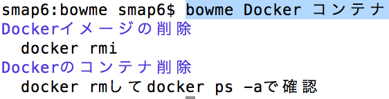

# bowme

Help you to find the commands that you remember ambiguously.


*photo by [DaPuglet](https://flic.kr/p/Q2rT5L)*

## Usage

```
bowme "your ambiguous words"
```



### Use your original `bowme.csv`

* Create the `bowme.csv` on [Gist](https://gist.github.com/)
  * please refer my [`bowme.csv`](https://gist.github.com/icoxfog417/55cddaa1b0c35c26cac0bace2f2b6940)
* Then, register gist id to `BOWME_GIST_ID`.
  * `export BOWME_GIST_ID=your gist id`
  * You can confirm gist id from url(`https://gist.github.com/your_github_id/your_gist_id`)


## Install

1. `git clone https://github.com/chakki-works/bowme.git`
2. `go install`

If you encounter `no install location for directory~` error, please try to set `GOBIN`.

```
export GOBIN=$GOPATH/bin
```

